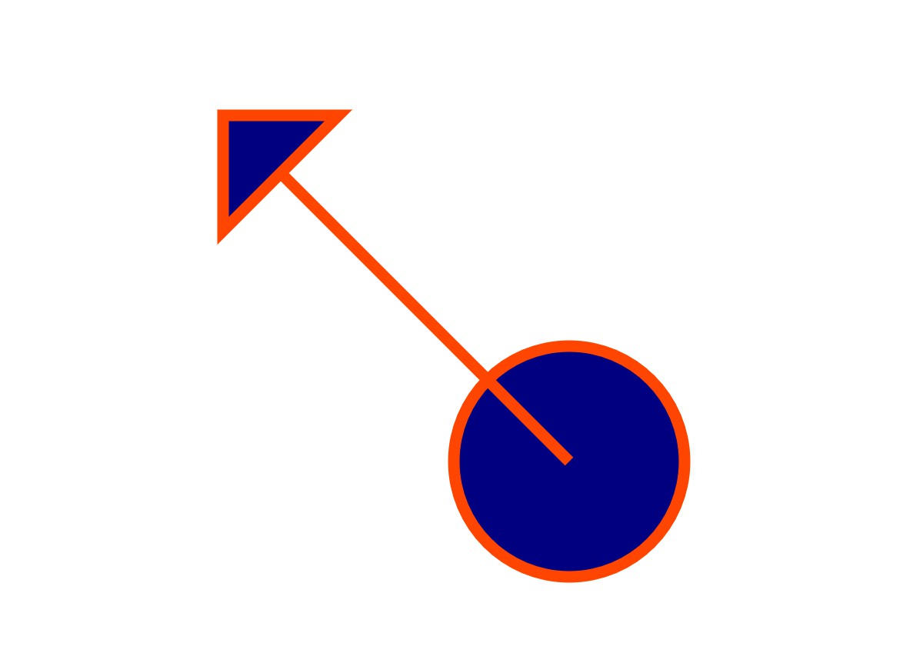

## Assignment 7

### Due: 23:59, 12 Janurary 2021 (System is reopened) 

### Requriement

For this assignment, you shuold have (1) src folder (2) test folder (3) bin folder (4) makefile in root folder.

In src -> svg_circle.h & svg_line.h & svg_polygon.h & svg_shape.h

In test -> ut_main.cpp & test_svg_shape.h

Your ut_main.cpp should be compiled as a runnable with name -> bin/ut_all

Your makefile need to be updated too for this homework.

### Before starting coding:

You need to remove files from HW06. Continue with example code given in this homework.

### Purpose of this assignment:

Practice to implement a polymorphism structure.

### Problems:

For this assignment, please implement the classes, according to the given [unit tests](https://css-gitlab.csie.ntut.edu.tw/qoolili/oop2020f_hw/-/blob/master/unit_test__1_.zip), to generate SVG format string of each shapes, and make sure all the given unit tests pass.
You'll have to implement the following shapes: line, circle, polygon.

**For SVG usage, please refer:[SVG tutorial](https://www.w3schools.com/graphics/svg_polygon.asp)**

### Important:

1. Please add **xmlns="http://www.w3.org/2000/svg"** in to svg tag, which looks like:
**<svg xmlns="http://www.w3.org/2000/svg"  ......>**

2. **Please do not add any public method.**

### Out put:
You'll get Shapes.svg file in your work space after your unit tests executed successfully. You could open the SVG file with your browser, and it should looks like the following image:


### Prototype of Prism:
#### svg_shape.h
```
    class SvgShape {
    public:
        SvgShape(){ ... }
        void setFillColor(std::string fillColor) { ... }
        void setStroke(double strokeWidth, std::string strokeColor) { ... }
        virtual std::string toSVG() const = 0;
    protected:
        ...
    private:
        double _strokeWidth;
        std::string _fillColor, _strokeColor;
    };
    void setSvgShapeStyle(SvgShape * shape, double strokeWidth, std::string strokeColor, std::string fillColor){ ... }
    std::string makeSvgOutput(int width, int height, std::vector<SvgShape *> const & shape){ ... }
```
#### svg_polygon.h
```
    class SvgPolygon : public SvgShape {
    public:
        SvgPolygon(std::vector<double *> const & v): ... { ... }
        std::string toSVG() const { ... }
    private:
        std::vector<double *> _v;
    };
```
#### svg_line.h
```
    class SvgLine : public SvgShape {
    public:
        SvgLine(double x1, double y1, double x2, double y2): ... { ... }
        std::string toSVG() const { ... }
    private:
        double _x1, _y1, _x2, _y2;
    };
```
#### svg_circle.h
```
    class SvgCircle : public SvgShape {
    public:
        SvgCircle(double x, double y, double r): ... { ... }
        std::string toSVG() const { ... }
    private:
        double _x, _y, _r;
    };
```


Note:
1. Please implement your test cases reasonably, or you will get no point for that sub-problem.
2. for float number test, you should use ASSERT_NEAR(EXPCET, ACTUAL, ALPHA) instead of ASSERT_EQ(EXPCET, ACTUAL).
